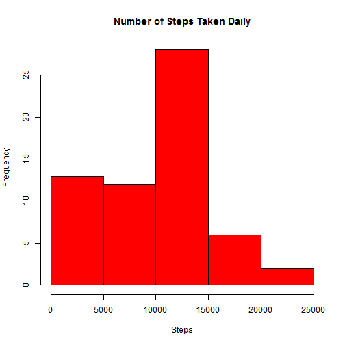
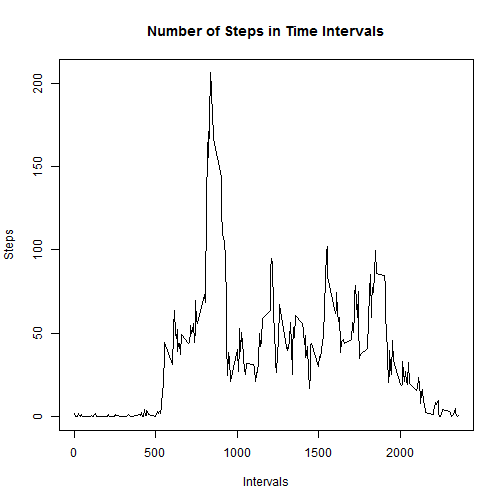
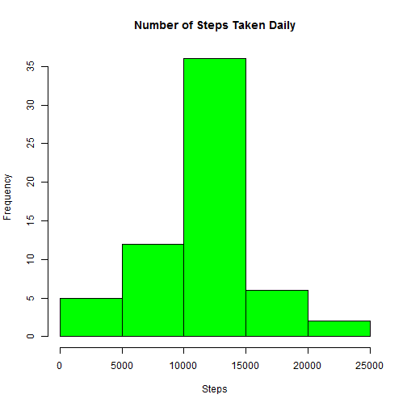
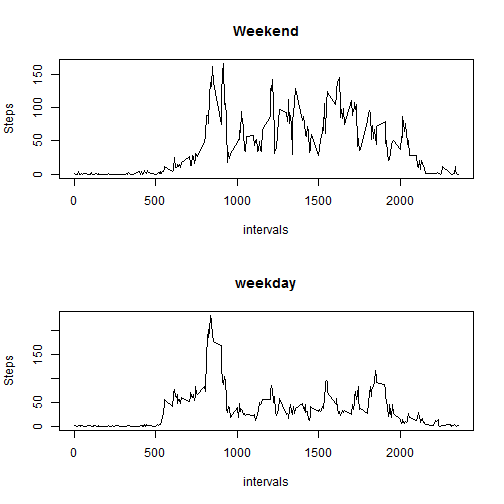

Reproducible Research - Assignment I
====================================

## Introduction

This document is assignment for the course Reproducible Research at Johns Hopkins
University available at Coursera. This work makes use of activity measurement data from a single person and makes some simple summaries of the behaviour.

## Data Analysis

The analysis follows the instructions of the assingment and the steps performed are described here.

### Downloading of data

The data used in this exercise is available at <https://d396qusza40orc.cloudfront.net/repdata%2Fdata%2Factivity.zip>. The code presented in this work assumes that this data is downloaded and unzipped into the working directory.

The data contains three columns descriping number of steps measured, date of the measurement and the label of the five minute time interval of the measurement. It is read into variable "data" and the dates are converted from strings into Date-class for convenience in the later analysis.

```r
data <- read.csv("./repdata_data_activity/activity.csv")
data[,2] <- as.Date(data[,2])
```

### Daily Activity

As starting point of analysis, the number of daily steps is calculated from the data. The results are saved in new table "dailysteps" consisting of two columns: the dates and the number of steps. Missing values are removed.


```r
dailysteps <- data.frame()
days <- unique(data$date)

for (k in 1:length(days)) {
  dailysteps[k,1] <- days[k]
  dailysteps[k,2] <- sum(data[data$date == days[k],1],na.rm = TRUE)
}
```

The resulting data is visualized as a histogram of steps taken.


```r
hist(dailysteps[,2], main = "Number of Steps Taken Daily", xlab = "Steps", col = "red")
```

 

Additionally, mean and median of the number of steps are calculated.


```r
mean(dailysteps[,2])
```

```
## [1] 9354
```

```r
median(dailysteps[,2])
```

```
## [1] 10395
```

### Daily Activity Pattern

To see how the activity varies during the day, the averages of steps for each time interval are calculated and saved to a new table. Again, missing values are removed.


```r
intersteps <- data.frame()
intervals <- unique(data$interval)

for (k in 1:length(intervals)) {
  intersteps[k,1] <- intervals[k]
  intersteps[k,2] <- mean(data[data$interval == intervals[k],1],na.rm = TRUE)
}
names(intersteps) <- c("interval","steps")
```

This new data is plotted.


```r
plot(intervals, intersteps[,2],type = "l", 
     main = "Number of Steps in Time Intervals", xlab = "Intervals", 
     ylab = "Steps")
```

 

The figure shows great spike of activity around interval 800, but the exact interval of maximum activity is determined.


```r
intersteps[intersteps$steps == max(intersteps$steps),1]
```

```
## [1] 835
```

### Replacing missing values

Previous analysis is biased because of significant number of missing values. 


```r
sum(is.na(data[,1]))
```

```
## [1] 2304
```

To solve this problem a simple scheme for replacing missing values is devised. Each missing value is replaced by the mean value for the corresponding time interval. This is easy to implement, as the averages are available from previous analysis, and it should not introduce significant bias into the data.

The new dataset is formed and the analysis for daily steps repeated.

```r
data2 <- data
for (k in 1:nrow(data2)){
  if (is.na(data2[k,1])){
    data2[k,1] <- intersteps[intersteps$interval == data[k,3],2]
  }
}

dailysteps2 <- data.frame()
for (k in 1:length(days)) {
  dailysteps2[k,1] <- days[k]
  dailysteps2[k,2] <- sum(data2[data2$date == days[k],1])
}
```

Histogram of daily steps show that replacing NA:s with averages clearly lowers the number of days with very few steps. This results in larger mean and median of the number of steps.


```r
hist(dailysteps2[,2], main = "Number of Steps Taken Daily", xlab = "Steps", col = "green")
```

 

```r
mean(dailysteps2[,2])
```

```
## [1] 10766
```

```r
median(dailysteps2[,2])
```

```
## [1] 10766
```

### Weekdays vs. Weekends

We want to find out if the activity in the weekends is different from the activity on weekdays. To achieve this, a new factor variable describing whether the date is weekday or not is introduced. This is done by using weekdays() function that returns the name of the day for given date. You'll notice that this code was run in Windows system with Finnish language, you'll need to edit the code if you run it with different locale.


```r
wendornot <- vector()
weekendind <- weekdays(data2$date)=="lauantai"| weekdays(data2$date)=="sunnuntai"
wendornot[weekendind] <- "weekend"
wendornot[!weekendind] <- "weekday"
data2[,4]<-as.factor(wendornot)
names(data2)[4] <- "weekd"
```

With help of the new variable, separate averages for intervals in weekdays and weekend are calculated.


```r
weekd <- vector()
weeke <- vector()
for (k in 1:length(intervals)) {
  weekd[k] <- mean(data2[data2$interval == intervals[k] & data2$weekd ==   "weekday", 1])
  weeke[k] <- mean(data2[data2$interval == intervals[k] & data2$weekd == "weekend", 1])
}
```
And plotted.


```r
par(mfrow = c(2,1))
plot(intervals, weeke, main = "Weekend", type = "l", ylab ="Steps")
plot(intervals,weekd, main = "weekday", type = "l", ylab = "Steps")
```

 

As can be expected, activity on the weekends differs from the activity on the weekdays. Activity clearly starts earlier on weekdays, goes on later on weekends and is much more varied on weekends during the office hours.
